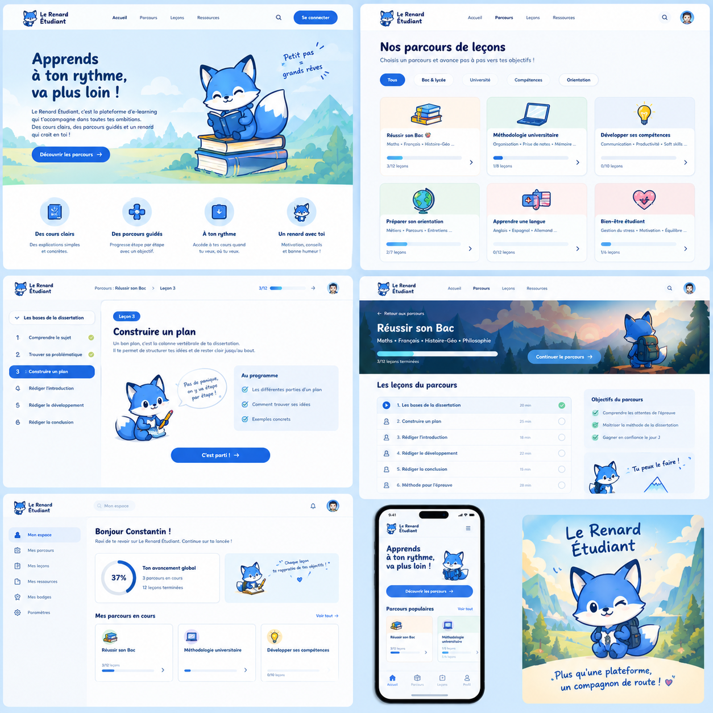

# Identité visuelle — Le Renard Étudiant

> Version 0.2 · 5 octobre 2026 · Statut : validé, d'après la [planche de maquettes](maquettes/planche-da-v1.png)

## L'ambiance

**Kawaï japonais, en bleu.** Un apprentissage doux, encourageant et joyeux : on n'a pas peur de se tromper.

| Mot-clé | Comment ça se traduit |
|---|---|
| Doux | Coins très arrondis, ombres légères, fonds bleu ciel |
| Mignon | Un renard bleu expressif, des icônes rondes en couleur |
| Encourageant | Petites phrases manuscrites : « Petit pas = grands rêves », « Tu peux le faire ! » |
| Lisible | Titres bleu nuit très gras, beaucoup d'espace blanc |

## La mascotte : le renard bleu

Un **renard bleu** en style chibi : grosse tête, grands yeux fermés quand il sourit, ventre et bout de queue blancs.
C'est **lui, l'étudiant** : il apprend aux côtés de l'utilisateur, qui est un professionnel. Le renard peut être espiègle, mais le ton du site reste adulte : jamais scolaire ni infantilisant.

| Moment | Attitude |
|---|---|
| Accueil | Assis sur une pile de livres, il lit |
| Présentation d'un parcours | De dos, sac à dos, il regarde la montagne |
| Début de leçon | Il écrit, avec une bulle : « Pas de panique, on y va étape par étape ! » |
| Code qui fonctionne | Il sourit, avec des petites étoiles |
| Erreur dans le code | Il penche la tête, curieux (jamais triste) |
| Leçon ou parcours terminé | Il saute de joie |
| Page introuvable | Il cherche avec une loupe |

**Règles** :
- Les illustrations sont **décoratives** (`alt=""`). Le texte d'une bulle existe aussi en vrai texte HTML, jamais seulement dans l'image.
- Dans les leçons, le renard reste discret : une seule apparition, en début de page.
- Les illustrations (renard, paysages à l'aquarelle) sont des fichiers SVG ou WebP optimisés, chargés seulement quand ils deviennent visibles.

## Couleurs

Le **bleu** domine. Le turquoise et les pastels servent d'accents.

Le site suit le thème de l'appareil. Dans son profil, chacun peut choisir Clair ou Sombre à la place ([ADR 0024](adr/0024-choix-du-theme.md)).

### Thème clair (par défaut)

| Rôle | Nom | Couleur | Contraste |
|---|---|---|---|
| Fond de page | `fond` | `#EEF6FF` | — |
| Cartes, panneaux | `surface` | `#FFFFFF` | — |
| Titres, texte | `texte` | `#14254F` | 13,7:1 ✅ |
| Texte secondaire | `texte-doux` | `#51617F` | 5,7:1 ✅ |
| Boutons, liens, onglet actif | `primaire` | `#1F5FD6` | 5,3:1 ✅ (texte blanc dessus : 5,7:1) |
| Survol des boutons | `primaire-fonce` | `#1748A8` | 7,6:1 ✅ |
| Barres de progression | `progression` | `#3A7FE6` | 3,6:1 ✅ (élément graphique) |
| Accent turquoise | `turquoise` | `#3CCFC4` | décor seulement ⚠️ |
| Coche « terminé » | `succes-icone` | `#24965A` | 3,5:1 ✅ (icône) |
| Texte de succès | `succes` | `#1A7A43` | 4,9:1 ✅ |
| Erreur | `erreur` | `#C2334D` | 5,0:1 ✅ |
| Bordure des champs | `bordure` | `#6F86AE` | 3,4:1 ✅ |
| Mots trouvés par la recherche | `surlignage` | `#FFE7A0` | fond ; texte `texte` dessus : 11,2:1 ✅ |

Contrastes mesurés sur `fond`. Ils sont tous un peu meilleurs sur `surface`.

**Pastels**, pour les en-têtes des cartes de parcours (le texte foncé dessus dépasse toujours 12:1) :

| `peche` | `menthe` | `soleil` | `sakura` | `ciel` |
|---|---|---|---|---|
| `#FDEBDD` | `#E2F5EC` | `#FFF4D2` | `#FDE4EA` | `#E3EFFD` |

⚠️ Le **turquoise vif** ne sert jamais pour du texte ni pour un contour utile. On l'utilise en décor, ou comme fond avec du texte `texte` dessus (7,8:1).

### Thème sombre

| Rôle | Couleur | Contraste |
|---|---|---|
| `fond` | `#0E1A33` | — |
| `surface` | `#16264A` | — |
| `texte` | `#EAF2FF` | 15,4:1 ✅ |
| `texte-doux` | `#A8B8D6` | 8,6:1 ✅ |
| `primaire` | `#7CB0FF` | 7,8:1 ✅ (texte `fond` dessus) |
| `turquoise` | `#4FD8CD` | 9,9:1 ✅ |
| `succes` | `#6BD69A` | 9,6:1 ✅ |
| `erreur` | `#FF8FA3` | 8,0:1 ✅ |
| `surlignage` | `#5C4A12` | fond ; texte `texte` dessus : 7,6:1 ✅ |

Le thème suit le réglage du système, et un bouton permet de le changer.

## Typographie

| Usage | Police | Exemple dans les maquettes |
|---|---|---|
| Titres | **Nunito** ExtraBold (800) | « Apprends à ton rythme, va plus loin ! » |
| Texte | **Nunito** Regular (400) et Bold (700) | Descriptions, listes de leçons |
| Bulles et petites phrases | **Caveat** (manuscrite) | « Tu peux le faire ! » |
| Code | **JetBrains Mono** | Blocs de code des leçons |

- Les polices sont **hébergées sur notre serveur**, et non chargées depuis Google Fonts (RGPD, voir [ADR 0014](adr/0014-rgpd.md)).
- Caveat est réservée aux phrases courtes et décoratives, jamais aux informations importantes.
- Taille du texte : 18 px minimum dans les leçons. Interligne : 1,6.

## Formes et composants

| Élément | Règle |
|---|---|
| Boutons principaux | En forme de pilule, fond `primaire`, texte blanc, flèche → à droite |
| Filtres (Tous, Python…) | Pilules à contour. L'actif est rempli en `primaire` |
| Cartes de parcours | Coins de 20 px, en-tête pastel avec une icône, titre, mots-clés, barre de progression, « 3/12 leçons », chevron |
| Badge « Leçon 3 » | Petite pilule `primaire` |
| Encadrés (« Au programme », « Objectifs ») | Fond `ciel`, coches `succes-icone` |
| Progression | Barre arrondie, ou cercle avec un pourcentage, **toujours accompagnée du texte** (« 37 % », « 3/12 leçons ») |
| Ombres | Légères, teintées de bleu : `0 4px 16px rgb(20 37 79 / 0.08)` |
| Espacements | Multiples de 4 px |
| Focus clavier | Anneau `primaire` de 3 px, toujours visible |
| Animations | Douces (200 ms), désactivées si l'utilisateur a choisi « réduire les animations » |

## Écrans de référence

| Écran | Ce qu'on reprend des maquettes |
|---|---|
| **Accueil** (public) | Logo, menu, bouton « Se connecter », grand titre avec le renard sur ses livres, bouton « Découvrir les parcours », 4 atouts avec icônes |
| **Catalogue des parcours** (public) | Titre, filtres en pilules, grille de cartes de parcours |
| **Présentation d'un parcours** (public) | Bandeau illustré, mots-clés, progression, bouton « Continuer le parcours », liste des leçons avec leur durée et une coche, encadré « Objectifs du parcours » |
| **Leçon** | Fil d'Ariane, progression « 3/12 » en haut, sommaire du parcours à gauche, badge « Leçon N », titre, renard avec sa bulle, encadré « Au programme », contenu |
| **Mon espace** | « Bonjour [pseudo] ! », cercle d'avancement global, parcours en cours, menu latéral |
| **Mobile** | Menu burger en haut, barre d'onglets en bas : Accueil, Parcours, Leçons, Profil |

## Écarts entre les maquettes et la V1

Les maquettes donnent la **direction artistique**. Certains éléments ne sont pas prévus en V1 :

| Dans les maquettes | En V1 |
|---|---|
| Parcours « Réussir son Bac », « Apprendre une langue », « Bien-être »… | Parcours de **programmation** uniquement |
| Filtres « Bac & lycée », « Université »… | Filtres par **thème** (Python, JavaScript) et par **niveau** |
| Menu « Ressources », « Mes ressources » | Retiré |
| « Mes badges » | Retiré (hors V1) |
| Cloche de notifications | Retirée |
| Avatar avec photo | Initiales du pseudo dans un rond |
